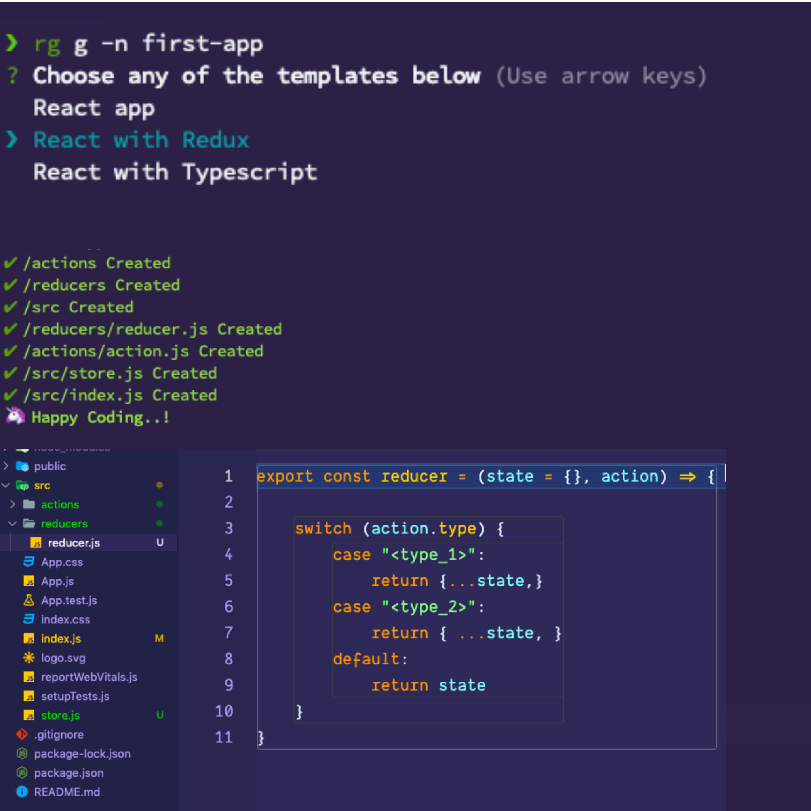

React-Generator
====

A light weight CLI for generating a React/React-Redux project. 

* [Installation](#Installation)
* [Command](#command)

# Installation

```sh-session
$ npm install -g react-project-generator
$ rg --version
1.0.0
```
# Note
```Only Support node version > 12```

# command


# `[rg g -n app-name]`

This command will prompts you with the list of choices.

```sh-session
$ rg g -n my-first-app
Choose any of the templates below (Use arrow keys)
React app
>React with Redux
React with Typescript
```
This will create the project with the name of my-first-app with the template you have choosen. 

# Snapshot


